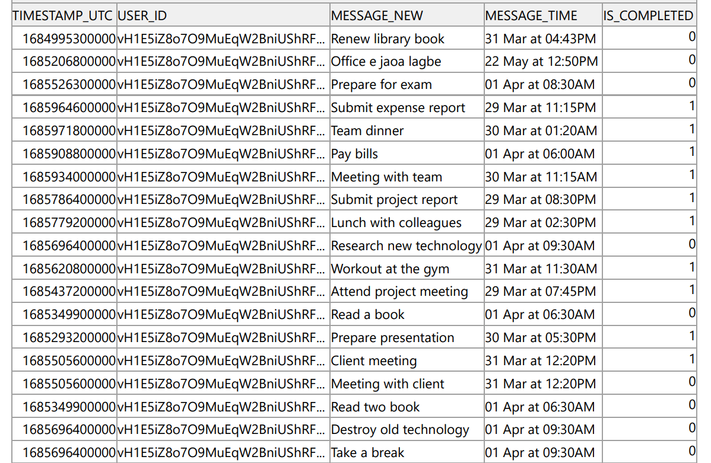
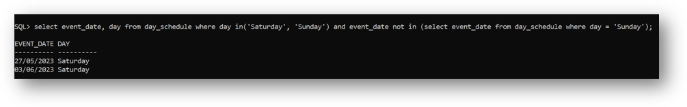
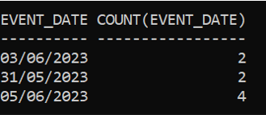
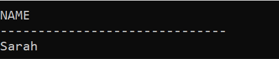
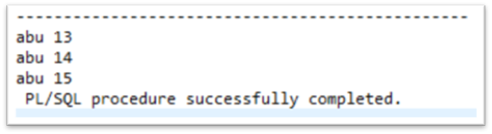

# ScheduleManagement
## Database project

### DB Schema
<!--  -->

## Creating user
1. ### Connect to system
    ```
    connect system
    ```
    > Then enter password
2. ### Create user
    ```
    create user saeed identified by saeed;
    ```
    > create user user_name identified by password;
3. ### Grant all priviledges
    ```
    grant all privileges to saeed;
    ```
4. ### Connect to the user
    ```
    disconnect
    connect saeed;
    ```
    > Then enter password


## Important command

- ### Clear sql terminal
    ```
    clear screen
    ```
- ### Print into Sql Terminal
    ```
    prompt your message;
    ```
- ### Run .sql file
    ```
    start C:\Users\User\Documents\Codes\SQL\ScheduleManagement\ddl.sql
    ```
    > start path/filename.sql;
- ### Set linesize
    ```
    show linesize
    set linesize 100
    ```
- ### Set pagesize
    ```
    show pagesize
    set pagesize 50
    ```
- ### Show all tables
    ```
    select table_name from user_tables;
    ```    
- ### Show current user
    ```
    show user
    ```
- ### Show table schema
    ```
    describe test;
    ```
    > describe table_name;

<hr>

## Order of execution
<table border = "1px">
    <td>FROM</td>
    <td>WHERE</td>
    <td>GROUP BY</td>
    <td>HAVING</td>
    <td>SELECT</td>
    <td>ORDER BY</td>
    <td>LIMIT</td>
</table>

# DDL
- ### Create table - dummy
    ```
    create table test(
        id varchar(20),
        primary key(id)
    );
    ```
- ### Drop table
    ```
    drop table test;
    ```
    > drop table table_name;
- ### Drop table ignoring constraints
    ```
    drop table test CASCADE constraint;
    ```
- ### Add new column
    ```
    alter table test add address varchar(20);
    ```
    > alter table table_name add column_name type;
- ### Modify column name
    ```
    alter table test rename column address to user_name;
    ```
    > alter table table_name rename column old_col to new_col;
- ### Modify column definition
    ```
    alter table test modify user_name varchar(50);
    ```
    > alter table table_name modify column_name type;
- ### Drop column
    ```
    alter table test drop column user_name;
    ```
    > alter table table_name drop column column_name;

<hr>

## My project's table creation
``` 
drop table notification;
drop table time_schedule;
drop table day_schedule;
drop table user_table;

create table user_table(
	user_id varchar(50) primary key,
	name varchar(30),
	email varchar(30) not null,
	password varchar(20) not null
);

create table day_schedule(
	event_date varchar(10) primary key,
	time_in_day integer not null,
	day varchar(10),
	uploader varchar(30),
	upload_time varchar(20),
	user_id varchar(50),
	foreign key(user_id) references user_table(user_id)
);

create table time_schedule(
	ts_midnight integer not null,
	timestamp_utc integer,
	message_time varchar(10),
	message varchar(200),
	upload_time varchar(20),
	is_completed integer,
	user_id varchar(50),
	event_date varchar(10),
	foreign key(user_id) references user_table(user_id),
	foreign key(event_date) references day_schedule(event_date),
	primary key(user_id,timestamp_utc)
    
    CONSTRAINT check_mid_utc CHECK (
        ( is_completed in(0,1) ) and
        (timestamp_utc > 0) and
        (ts_midnight > 0)
    )
);

create table notification(
	timestamp_utc integer CHECK (timestamp_utc > 0),
	user_id varchar(50),
	message_new varchar(200),
	message_time varchar(10),
	is_completed integer CHECK (is_completed IN (0,1)),
	foreign key(user_id,timestamp_utc) references time_schedule(user_id,timestamp_utc),	
	primary key(user_id,timestamp_utc)
    on delete cascade
);

```
<hr>

# DML
- ## Insert
    - ### Inserting into user_table
    ```
    insert into user_table(user_id,name,email,password) values('JWP8311UP3fXZn39o3JPCwlKd6q2','Abu Saeed','saeed1907057@stud.kuet.ac.bd','abusaeed');

    insert into user_table values('vH1E5iZ8o7O9MuEqW2BniUShRFq2','Saeed','abusaeed2433@gmail.com','saeed');

    insert into user_table values('a2E5iZ8o7O9MuEqW2BniUShRFq2','Saeed','abu123@gmail.com','Abu');
    insert into user_table values('b11E5iZ8o7O9MuEqW2BniUShRFq3','John','john101@gmail.com','John');
    insert into user_table values('c12E5iZ8o7O9MuEqW2BniUShRFq4','Mary','mary101@gmail.com','Mary');

    insert into user_table values('d13E5iZ8o7O9MuEqW2BniUShRFq5','Peter','peter101@gmail.com','Peter');
    insert into user_table values('e14E5iZ8o7O9MuEqW2BniUShRFq6','Susan','susan101@gmail.com','Susan');
    insert into user_table values('f15E5iZ8o7O9MuEqW2BniUShRFq7','David','david101@gmail.com','David');
        
    insert into user_table values('g16E5iZ8o7O9MuEqW2BniUShRFq8','Michael','michael101@gmail.com','Michael');
    insert into user_table values('h17E5iZ8o7O9MuEqW2BniUShRFq9','Sarah','sarah101@gmail.com','Sarah');
    insert into user_table values('i18E5iZ8o7O9MuEqW2BniUShRFq10','James','james101@gmail.com','James');
    ```
    - ### Inserting into day_schedule
    ```
    insert into day_schedule(event_date,time_in_day,day,uploader,upload_time,user_id) values('25/05/2023',19366,'Thursday','Saeed','22 May at 12:50PM','vH1E5iZ8o7O9MuEqW2BniUShRFq2');

    insert into day_schedule values('27/05/2023',19368,'Saturday','Saeed','23 May at 08:16AM','vH1E5iZ8o7O9MuEqW2BniUShRFq2');
    insert into day_schedule values ('28/05/2023', 19369, 'Sunday', 'Saeed', '24 May at 09:30AM', 'vH1E5iZ8o7O9MuEqW2BniUShRFq2');
    insert into day_schedule values ('29/05/2023', 19370, 'Monday', 'Saeed', '25 May at 11:45AM', 'vH1E5iZ8o7O9MuEqW2BniUShRFq2');

    insert into day_schedule values ('30/05/2023', 19371, 'Tuesday', 'Saeed', '26 May at 01:00PM', 'vH1E5iZ8o7O9MuEqW2BniUShRFq2');
    insert into day_schedule values ('31/05/2023', 19372, 'Wednesday', 'Saeed', '27 May at 02:15PM', 'vH1E5iZ8o7O9MuEqW2BniUShRFq2');
    insert into day_schedule values ('01/06/2023', 19373, 'Thursday', 'Saeed', '28 May at 03:30PM', 'vH1E5iZ8o7O9MuEqW2BniUShRFq2');

    insert into day_schedule values ('02/06/2023', 19374, 'Friday', 'Saeed', '29 May at 04:45PM', 'vH1E5iZ8o7O9MuEqW2BniUShRFq2');
    insert into day_schedule values ('03/06/2023', 19375, 'Saturday', 'Saeed', '30 May at 06:00PM', 'vH1E5iZ8o7O9MuEqW2BniUShRFq2');
    insert into day_schedule values ('05/06/2023', 19377, 'Monday', 'Saeed', '01 June at 08:30PM', 'vH1E5iZ8o7O9MuEqW2BniUShRFq2');
    ```
    - ### Inserting into time_schedule
    ```
    insert into time_schedule(ts_midnight,timestamp_utc,message_time,message,upload_time,is_completed,event_date) 
    values(735,1684995300000,'12:15PM','Renew library book','22 May at 12:50PM',0,'25/05/2023');

    insert into time_schedule values (1380, 1685206800000,'11:00PM','Office e jaoa lagbe','31 Mar at 04:43PM',0,'27/05/2023');

    INSERT INTO time_schedule VALUES (1380, 1685293200000, '11:00PM', 'Prepare presentation', '30 Mar at 05:30PM', 1, '28/05/2023');

    INSERT INTO time_schedule VALUES (885, 1685349900000, '02:45PM', 'Read a book', '24 May at 06:20PM', 0, '29/05/2023');

    INSERT INTO time_schedule VALUES (900, 1685437200000, '03:00PM', 'Attend project meeting', '24 May at 06:20PM', 1, '30/05/2023');

    INSERT INTO time_schedule VALUES (600, 1685505600000, '10:00AM', 'Client meeting', '31 Mar at 12:20PM', 1, '31/05/2023');
    INSERT INTO time_schedule VALUES (945, 1685526300000, '03:45PM', 'Prepare for exam', '24 May at 06:17PM', 0, '31/05/2023');

    INSERT INTO time_schedule VALUES (1080, 1685620800000, '06:00PM', 'Workout at the gym', '31 Apr at 11:30AM', 1, '01/06/2023');

    INSERT INTO time_schedule VALUES (900, 1685696400000, '03:00PM', 'Research new technology', '01 Apr at 09:30AM', 0, '02/06/2023');

    INSERT INTO time_schedule VALUES (840, 1685779200000, '02:00PM', 'Lunch with colleagues', '29 Mar at 02:30PM', 1, '03/06/2023');
    INSERT INTO time_schedule VALUES (960, 1685786400000, '04:00PM', 'Submit project report', '29 Mar at 08:30PM', 1, '03/06/2023');

    INSERT INTO time_schedule VALUES (120, 1685908800000, '02:00AM', 'Pay bills', '01 Apr at 06:00AM', 1, '05/06/2023');
    INSERT INTO time_schedule VALUES (540, 1685934000000, '09:00AM', 'Meeting with team', '30 Mar at 11:15AM', 1, '05/06/2023');
    INSERT INTO time_schedule VALUES (1050, 1685964600000, '05:30PM', 'Submit expense report', '29 Mar at 11:15PM', 1, '05/06/2023');
    INSERT INTO time_schedule VALUES (1170, 1685971800000, '07:30PM', 'Team dinner', '30 Mar at 01:20AM', 1, '05/06/2023');
    ```    
    - ### Inserting into notification
    ```
    INSERT INTO notification VALUES (1684995300000, 'vH1E5iZ8o7O9MuEqW2BniUShRFq2', 'Renew library book', '31 Mar at 04:43PM', 0);

    insert into notification values (1685206800000, 'vH1E5iZ8o7O9MuEqW2BniUShRFq2', 'Office e jaoa lagbe','22 May at 12:50PM',0);
    INSERT INTO notification VALUES (1685526300000, 'vH1E5iZ8o7O9MuEqW2BniUShRFq2', 'Prepare for exam', '01 Apr at 08:30AM', 0);
    INSERT INTO notification VALUES (1685964600000, 'vH1E5iZ8o7O9MuEqW2BniUShRFq2', 'Submit expense report', '29 Mar at 11:15PM', 1);

    INSERT INTO notification VALUES (1685971800000, 'vH1E5iZ8o7O9MuEqW2BniUShRFq2', 'Team dinner', '30 Mar at 01:20AM', 1);
    INSERT INTO notification VALUES (1685908800000, 'vH1E5iZ8o7O9MuEqW2BniUShRFq2', 'Pay bills', '01 Apr at 06:00AM', 1);
    INSERT INTO notification VALUES (1685934000000, 'vH1E5iZ8o7O9MuEqW2BniUShRFq2', 'Meeting with team', '30 Mar at 11:15AM', 1);

    INSERT INTO notification VALUES (1685786400000, 'vH1E5iZ8o7O9MuEqW2BniUShRFq2', 'Submit project report', '29 Mar at 08:30PM', 1);
    INSERT INTO notification VALUES (1685779200000, 'vH1E5iZ8o7O9MuEqW2BniUShRFq2', 'Lunch with colleagues', '29 Mar at 02:30PM', 1);
    INSERT INTO notification VALUES (1685696400000, 'vH1E5iZ8o7O9MuEqW2BniUShRFq2', 'Research new technology', '01 Apr at 09:30AM', 0);

    INSERT INTO notification VALUES (1685620800000, 'vH1E5iZ8o7O9MuEqW2BniUShRFq2', 'Workout at the gym', '31 Mar at 11:30AM', 1);
    INSERT INTO notification VALUES (1685437200000, 'vH1E5iZ8o7O9MuEqW2BniUShRFq2', 'Attend project meeting', '29 Mar at 07:45PM', 1);
    INSERT INTO notification VALUES (1685349900000, 'vH1E5iZ8o7O9MuEqW2BniUShRFq2', 'Read a book', '01 Apr at 06:30AM', 0);

    INSERT INTO notification VALUES (1685293200000, 'vH1E5iZ8o7O9MuEqW2BniUShRFq2', 'Prepare presentation', '30 Mar at 05:30PM', 1);
    INSERT INTO notification VALUES (1685505600000, 'vH1E5iZ8o7O9MuEqW2BniUShRFq2', 'Client meeting', '31 Mar at 12:20PM', 1);
    ```


- ## All data
    - ### user_table -server
    

    - ### day_schedule -client
    

    - ### time_schedule -client
    

    - ### notification -server
    

- ## Read operation ?
    - ### Integrity constraint
    
    
    > Data is not being inserted beacuse user_id is foreign key to user_table and '111vH1E5iZ8o7O9MuEqW2BniUShRFq2' doesn't exist at user table.
    - ### Displaying data with event data '05/06/2023'
        > select, where
        ```
        select * from time_schedule where event_date = '05/06/2023';
        ```
        

    - ### Displaying date & number of schedules at that date
        > select, where, sub-query, aggregate function, rename table, naming column
        ```
        select event_date, (select count(*) from time_schedule ts where ds.event_date = ts.event_date) as no_of_schedules from day_schedule ds;
        ```
        
    
    - ### Finding upcoming one schedule with date
        > select, where, sub-query, aggregate-function, 2 tables
        ```
        select 
            event_date, 
            message
        from 
            time_schedule ts 
        where
        (
            ts.event_date = (
                select 
                    event_date 
                from day_schedule 
                where 
                    time_in_day = (
                        select 
                            min(time_in_day) 
                        from 
                            day_schedule
                )
            )
        );
        ```
        


- ## Update operation
    - ### Updating user's name
        > update name of a specified user
        ```
        update user_table set name='Md Abu Saeed' where user_id = 'a2E5iZ8o7O9MuEqW2BniUShRFq2';
        ```
        

- ## Delete operation
    - ### dummy insert
        ```
        insert into day_schedule 
        values(
            '27/01/2023',19368,'Saturday','Saeed','23 May at 08:16AM','i18E5iZ8o7O9MuEqW2BniUShRFq10'
        );
        ```
        > 1 row created.

    - ### deleting added data
        ```
        delete from
            day_schedule
        where 
            user_id = 'i18E5iZ8o7O9MuEqW2BniUShRFq10' 
            and event_date = '27/01/2023';
        ```
        > 1 row deleted.


- ## union, intersect, except
    - ### union - all date of thursday and saturday    
        ```
        select 
            event_date,
            day 
        from 
            day_schedule 
        where 
            day = 'Thursday' 
        union 
        select 
            event_date, 
            day 
        from 
            day_schedule 
        where 
            day = 'Saturday';
        ```
        > Both set must have to have same no of column and definition

        

    - ### intersect - Show only Saturday
        ```
        select 
            event_date, 
            day 
        from 
            day_schedule 
        where 
            day in('Saturday', 'Sunday') 
        intersect 
        select 
            event_date, 
            day 
        from 
            day_schedule
        where 
            day = 'Saturday';
        ```
        

    - ### except - not supported in my db
        ```
        select 
            event_date, 
            day 
        from 
            day_schedule 
        where 
            day in('Saturday', 'Sunday') 
            and event_date not in (
            select 
                event_date 
            from 
                day_schedule 
            where 
                day = 'Sunday'
        );
        ```
        > Except is not supported in all database version

        

- ## with clause - date & number of schedules at that date
    
    > allows to give a 'sub-query block' a name

    ```
    with my_table(n_date,total) as (
        select 
            event_date, count(event_date) 
        from 
            time_schedule 
        group by 
            event_date
    )
    select 
        event_date, 
        total
    from 
        day_schedule , 
        my_table 
    where 
        event_date = n_date;
    ```
    

- ## Saving output to 
    Not working in my pc

- ## Aggregate function
    - ### AVG
        ```
        select avg(time_in_day) as avg from day_schedule;
        ```
    - ### COUNT
        ```
        select event_date, count(*) as total from time_schedule group by event_date;
        ```
        > shows date with schedule count
    - ### MAX
        ```
        select event_date from time_schedule where timestamp_utc = ( select max(timestamp_utc) from time_schedule);
        ```
        > shows last schedule date
    - ### MIN
        ```
        select event_date from time_schedule where timestamp_utc = ( select min(timestamp_utc) from time_schedule);
        ```
        > shows first schedule date
    - ### SUM
        ```
        select sum(is_completed) completed, count(*) - sum(is_completed) incomplete from time_schedule;
        ```
        > shows number of completed nad incomplete schedules

- ## Group by and Having
    ```
    select event_date, count(*) from time_schedule group by event_date having count(*) > 1;
    ```
    > Date with more than 1 schedules

    
    
    

- ## Set membership operation(and,or,not)
    ```
    select 
        user_id, 
        message_new 
    from 
        notification 
    where 
        (
            user_id = 'vH1E5iZ8o7O9MuEqW2BniUShRFq2' 
            or user_id = 'vH1E5iZ8o7O9MuEqW2BniUShRFq1'
        ) 
        and is_completed = 0;
    ```
    > all incomplete schedules of two user
    
    

- ## some/all/exists/unique
    - ### some
        ```
        select 
            event_date, 
            message 
        from 
            time_schedule 
        where 
            ts_midnight <= some(
                select 
                    ts_midnight 
                from 
                    time_schedule 
                where 
                    ts_midnight <= 735
            );
        ```        
        > All user's schedules before 12:16PM

        
    - ### all
        ```
        select 
            event_date, 
            message 
        from 
            time_schedule 
        where 
        ts_midnight <= all(
            select 
                ts_midnight 
            from 
                time_schedule 
            where 
                ts_midnight >= 735
        );
        ```        
        > All user's schedules before 12:16PM
        
        
    - ### exists
        ```
        select 
                name 
            from 
                user_table ut 
            where 
                exists(
                    select 
                        * 
                    from 
                        notification 
                    where 
                        user_id = ut.user_id
        );
        ```
        > All user's who has notification
        
        


- ## String operation
    > percent ( % ). The % character matches any substring

    > underscore ( _ ). The _ character matches any character

    - ### name having length 5
        ```
        select name from user_table where name like '_____';
        ```
        
    - ### name ends with h
        ```
        select name from user_table where name like '%h';
        ```
        
    - ### name containing e
        ```
        select name from user_table where name like '%e%';
        ```
        
- ## Join
    - ### natural join
    ```
    select 
        user_id, 
        event_date, 
        message 
    from 
        day_schedule natural 
        join time_schedule 
    where 
        user_id = 'vH1E5iZ8o7O9MuEqW2BniUShRFq2';
    ```
    

    <hr>

    ```
    select user_id, name, event_date from user_table natural join day_schedule;

    select user_id,name,event_date from user_table join day_schedule using(user_id);

    select ut.user_id,name,event_date from user_table ut join day_schedule ds on ut.user_id = ds.user_id;
    ```
    > above 3 query produce same result

    

    - ### Left outer join
        ```
        select user_id,name,event_date from user_table left outer join day_schedule using(user_id);
        ```
        
    - ### Right outer join
        ```
        select user_id,name,event_date from user_table right outer join day_schedule using(user_id);
        ```
        
    - ### Full outer join
        ```
        select user_id,name,event_date from user_table full outer join day_schedule using(user_id);
        ```
        


- ## Views
    > view is a virtual table derived from the result of a query that can be treated a table. Views are useful for  simplifying complex queries.

    - ### Creating view
        ```
        create view my_view as select ts_midnight from time_schedule where ts_midnight >= 735;
        ```
    - ### using that view
        ```
        select event_date, message from time_schedule where ts_midnight <= all(select * from my_view);
        ```

        
    - ### Dropping that view
        ```
        drop view my_view;
        ```    
<hr>
<hr>

# PL/SQL
> Procedural Language extensions to the SQL. Enables developers to combine the power of SQL with procedural statements. Adds many procedural constructs to SQL language to overcome some limitations of SQL. It allows declaration of constants and variables, procedures and functions, types and variable of those types and triggers.
- ## variable declaration
    ```
    set serveroutput on
    declare
        name user_table.name%type;
        uid user_table.user_id%type;
        email varchar(50);
    begin
        select user_id,name,email into uid,name,email from user_table where user_id = 'vH1E5iZ8o7O9MuEqW2BniUShRFq2';
        dbms_output.put_line('UID: ' || uid || ' Name: ' || name || ' Email: ' || email );
    end;
    /
    ```
    

- ## Set values and insert
    ```
    set serveroutput on
    declare
        uid USER_TABLE.USER_ID%type := 'abcdef1234';
        email varchar(30) := 'abutest3456@gmail.com';
        name varchar(30) := 'A Saeed';
        password user_table.password%type := '123456';
    begin
        delete from user_table where user_id = 'abcdef1234';
        
        -- main line of code
        insert into user_table values(uid,email,name,password);

        select * into uid, name, email, password from user_table where user_id = 'abcdef1234';

        dbms_output.put_line(uid || ' ' || name || ' ' || email || ' ' || password);
    end;
    /
    ```
    
- ## RowType
    > A data type that represents a row in a table.
    ```
    set serveroutput on
    declare
        my_row user_table%rowtype;
    begin
        select * into my_row from user_table where user_id = 'abcdef1234';
        dbms_output.put_line(my_row.user_id || ' ' || my_row.email);
    end;
    /
    ```
    

- ## Cursor and Loop
    > A pointer to a set of rows returned by a SELECT query
    ```
    set serveroutput on
    declare
        cursor cur is select * from user_table;
        row user_table%rowtype;

    begin
        open cur;
        fetch cur into row;
        
        while cur % found loop
            dbms_output.put_line(row.user_id || ' ' || row.name);
            fetch cur into row;
        end loop;
        
        close cur;
    end;
    /
    ```
    

- ## Array and for loop
    - ### Declaring type
        ```
        TYPE NAME_ARR IS VARRAY(5) OF user_table.name%type;
        ```
        > It defines a user-defined collection type named NAME_ARR as a variable array of 5 elements. where each element is of type name in user_table
        
    - ### Creating variable
        ```
        arr NAME_ARR := NAME_ARR();
        ```
        > above line of code will initialize an array variable whose elements type is same as name of user_table.
    
    - ### with extend() function
        ```
        set serveroutput on
        declare
            type NAME_ARR is VARRAY(5) of user_table.name%type;
            arr NAME_ARR := NAME_ARR(); 
            counter number;
            
        begin
            counter := 1;
            for i in 13..15
            loop
                arr.extend();
                arr(counter) := 'abu ' || i;
                counter := counter+1;
            end loop;
            
            dbms_output.put_line('------------------------------------------------');
            
            counter := 1;
            while (counter <= arr.count ) 
            loop
                dbms_output.put_line(arr(counter));
                counter := counter+1;
            end loop;
            
        end;
        /
        ```

        

    - ### without extend() function
        ```
        set serveroutput on;

        declare
            TYPE ID_ARRAY is VARRAY(5) of USER_TABLE.USER_ID % type;
            
            uids ID_ARRAY := ID_ARRAY('vH1E5iZ8o7O9MuEqW2BniUShRFq2','c12E5iZ8o7O9MuEqW2BniUShRFq4','g16E5iZ8o7O9MuEqW2BniUShRFq8');
            
            uid USER_TABLE.USER_ID%type;
            name user_table.name%type;

        begin
            for i in 1..uids.count loop
                select user_id, name into uid, name from user_table where user_id = uids(i);
                dbms_output.put_line(uid || ' -> ' || name);
            end loop;
        end;
        /
        ```
        
    
    - ### extend() vs without extend()
        <table>
            <tr>
                <td>with</td>
                <td>without</td>
            <tr>
            <tr>
                <td>increase size dynamically by one</td>
                <td>size is defined manually</td>
            <tr>

            <tr>
                <td>need to extend before adding</td>
                <td>can assign directly</td>
            <tr>
        </table>
        
        > In both cases, size of array can't exceed the actual size while defining our array.
    
    - ### if / else / elsif
        ```
        set serveroutput on;
        declare
            TYPE ID_ARRAY is VARRAY(5) of USER_TABLE.USER_ID % type;
            
            uids ID_ARRAY := ID_ARRAY('vH1E5iZ8o7O9MuEqW2BniUShRFq2','c12E5iZ8o7O9MuEqW2BniUShRFq4','g16E5iZ8o7O9MuEqW2BniUShRFq8');
            
            uid USER_TABLE.USER_ID%type;
            name user_table.name%type;

        begin
            for i in 1..uids.count loop
                select user_id, name into uid, name from user_table where user_id = uids(i);
                dbms_output.put_line(name);
                if name = 'Saeed' then
                    dbms_output.put_line('hello idiot');
                elsif name = 'Mary' then
                    dbms_output.put_line('Hello Mary');
                else
                    dbms_output.put_line('Who are you?');
                end if;
            end loop;
        end;
        /
        ```

        

    - ### Procedure
        - Creating procedure
            ```            
            create or replace procedure printUserInfo(uid IN varchar, row OUT user_table%rowtype) as
                tmp varchar(30);
                begin
                    select * into row from user_table where user_table.user_id = uid;
                    
                    tmp := row.name;
                    dbms_output.put_line(tmp);
                end;
            /
            ```
            > after executing..

            
        - Calling procedure
            ```
            set serveroutput on

            declare
                val user_table%rowtype;
                uid varchar(30) := 'vH1E5iZ8o7O9MuEqW2BniUShRFq2';
            begin
                printUserInfo(uid,val);
                dbms_output.put_line(val.user_id || ' ' || val.name);
            end;
            /
            ```
            
        - Drop procedure
            ```
            drop procedure printUserInfo;
            ```
            > drop procedure procedure_name;
    
    - ### Function
        - Creating function
            ```            
            create or replace function getName(uid in varchar) return varchar as
                name varchar(30);
                begin
                    select user_table.name into name from user_table where user_table.user_id = uid;
                    
                    dbms_output.put_line('returning ' || name);
                    return name;
                end;
                /
            ```
        - Calling function
          
            ```
            set serveroutput on

            declare
                val varchar(30);
                uid varchar(30) := 'vH1E5iZ8o7O9MuEqW2BniUShRFq2';
            begin
                val := getName(uid);
                dbms_output.put_line(val);
            end;
            /
            ```

            
        - Drop function
            ```
            drop function getName;
            ```
            > drop function function_name;
    

    - ### procedure vs function
        <table>
            <tr>
                <td>Procedure</td>
                <td>Function</td>
            <tr>
            <tr>
                <td>Can't return value</td>
                <td>Can return value</td>
            <tr>
            <tr>
                <td> 
                cannot be directly used in SQL statement.
                </td>
                <td>Can be used in SQL statements directly</td>
            <tr>
        </table>
<hr>

